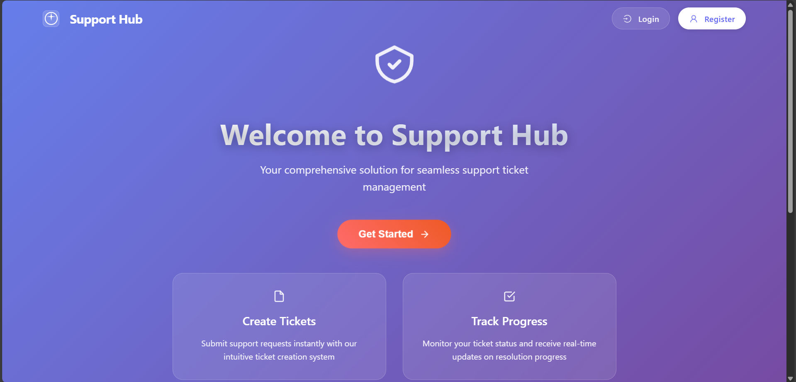

# 🎫 Support Hub – Ticketing System

Support Hub is a full-stack support ticketing system built with a modern MERN (MongoDB, Express, React, Node.js) stack. It allows users to register, log in, and create support tickets, while admin users can manage and respond to them in real time.

---

## 📸 Preview

 <!-- Replace with actual image path or upload -->

---

## 🚀 Features

- 🔐 User Authentication (Register / Login)
- 🧾 Ticket Submission & Management
- 🧑‍💻 Admin Dashboard for Ticket Oversight
- ✅ Status Tracking (New, Open, Closed)
- 💬 Comment/Reply System on Tickets
- 📦 Fully functional RESTful API
- 💡 Clean and responsive UI

---

## 🛠️ Tech Stack

**Frontend**  
- React.js + Vite  
- React Router  
- Axios  
- Tailwind CSS (optional)  

**Backend**  
- Node.js  
- Express.js  
- MongoDB + Mongoose  
- JSON Web Tokens (JWT)  
- bcrypt for password hashing  

---

## 🔧 Getting Started

### 📁 Clone the repository

```bash
git clone https://github.com/tanutripathi1810/Support-Hub.git
cd Support-Hub
```
## 🛠️ Backend Setup

Set up your environment variables in a `.env` file:

```env
PORT=5000
MONGO_URI=your_mongodb_connection_string
JWT_SECRET=your_jwt_secret
```
### 💻 Frontend Setup
```bash

cd frontend
npm install
npm run dev
```
### 📌 Future Improvements
- ✅ Email notifications

- 📈 Ticket analytics dashboard

- 🧑‍🤝‍🧑 Team-based support roles

- 🗃️ Ticket category filters and search

### 👤 Author
Tanu Tripathi
🔗 GitHub[!https://github.com/tanutripathi1810]
